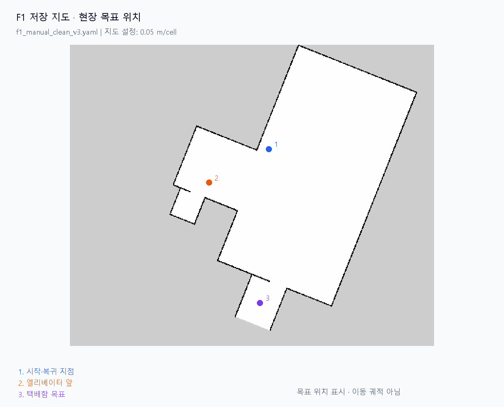
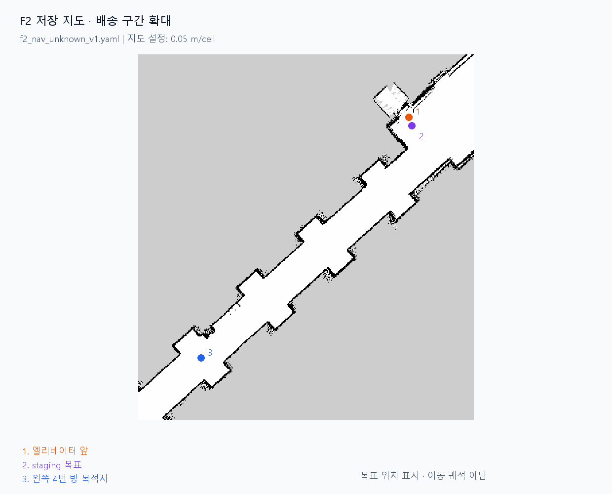

# 엘리베이터를 이용한 실내 택배 배달 로봇

Jetson에서 ROS 2 Humble, SLAM Toolbox, Nav2를 실행하고 OpenCR로 차동 주행을 제어한다.

## 2026-09-16 주행 결과

**현장 완주 성공을 확인했다(사용자 현장 보고). 수동 조작은 엘리베이터 탑승·하차 시에만 사용했으며, 복도 주행과 목적지 접근·복귀는 Nav2 자율주행으로 진행했다.**

| 직접 확인한 Nav2 성공 구간 | 종료 시각 (KST) | [측정값] 목표 처리 시간 |
|---|---|---|
| F2 엘리베이터 앞 → 왼쪽 4번 방 목적지 | 03:39:32.072 | 244.088 s |
| F1 엘리베이터 앞 → 시작 지점 복귀 | 04:30:51.493 | 119.226 s |

시간은 목표 시작·성공 로그 간격이다. 준비·재시도를 포함한 [전체 주행 결과표와 PPT 자료](docs/presentation_20260916/README.md)에 개별 실패 로그도 정리했다.

## 최신 코드

| 경로 | 내용 |
|---|---|
| `src/drive_pkg/` | OpenCR 통신, 휠 오도메트리, 속도·피드백 제한, 주행 안전 게이트 |
| `src/slam_pkg/` | 실기 센서·주행 launch, SLAM, AMCL·Nav2, F1·F2·F3 지도와 waypoint |
| `src/robot_arm_pkg/` | 서보 프로토콜, 누르기 사이클, 실행·취소 계약 |
| `scripts/fieldctl` | 지도 선택, 초기 위치 설정, 목표 전송, 기록·분석용 현장 CLI |
| `tools/button_arm_test/` | 숫자 1~4·▲▼ 버튼 인식, 픽셀→PWM 보정, 현재 누르기 자세·화살표 자세·등록 템플릿 |
| `tools/floor_reader/` | 카메라 ROI·템플릿 비교 기반 층수 인식과 목표층 이벤트 |
| `tools/field_tests/` | 현장 회전·RPM·주행 확인에 사용한 별도 스크립트 |

직전 GitHub 코드에서 바뀐 사항은 주행 시작 시 빈 속도 인자를 생략하는 수정과 `f2_delivery_left_room4`·`f1_initial_test` 목표 추가다. 젯슨 홈에 따로 있던 버튼·팔·층수 인식 코드와 등록 데이터를 함께 포함했다. [파일별 설명](docs/presentation_20260916/CODE_CHANGES.md)

## 발표용 지도

F1 기본 지도는 `f1_manual_clean_v3`, F2 기본 지도는 `f2_nav_unknown_v1`이다. 원본 PGM·YAML과 현재 선택 파일·지도 해시를 `src/slam_pkg/maps/field/`에 포함했다.

지도 이미지는 저장 지도와 목표 위치를 표시한다. 주행 결과의 근거는 [목표 결과표](docs/presentation_20260916/goal_results.csv)와 [Nav2 로그](docs/presentation_20260916/navigation_events.txt)다.
