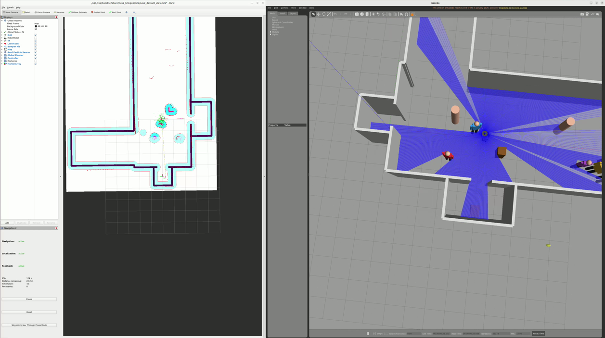

# PackagU — 엘리베이터 무인 배달 로봇 (종설 6조)

> 건물 로비 택배함에 쌓인 택배를 **로봇이 엘리베이터를 직접 타고** 층을 옮겨 문 앞까지 배달한다.
> 엘리베이터 서버와 연동하지 않고 **로봇팔로 버튼을 직접 누르는** 방식이라, 서버 연동이 어려운 건물에도 그대로 적용할 수 있다.

ROS2 Humble · SLAM Toolbox · Nav2 · Gazebo Classic — 시뮬레이션에서 먼저 검증한 스택을 Jetson Xavier NX 실기에 그대로 옮기는 **MBD(모델 기반 설계)** 흐름으로 개발한다. 모든 실행은 Docker 컨테이너 기준.



*신공학관 1층 가상 맵 — 왼쪽 RViz(Nav2 costmap·AMCL 파티클), 오른쪽 Gazebo(복도·보행자·RPLiDAR 스캔)*

## 배달 미션 한 사이클

```text
충전소 → 택배함(픽업) → 엘리베이터 탑승 → 층 전환(Nav2 맵 + Gazebo 건물 자동 교체)
      → 목적지 배달 → 엘리베이터 복귀 → 원래 층 → 충전소
```

전 과정이 **명령 한 번**으로 자동 진행되고, 목표 도달 여부도 스크립트가 자동 판정한다
(동적 보행자 · 경로 위 정적 장애물 · Z축 리프트 · 로봇팔 옵션 포함).

## 현재 상태 (2026-08-21)

| 항목 | 결과 |
|------|------|
| 왕복 배달 체인 시뮬 (데스크톱) | 보행자 + 정적 장애물 + 리프트 + 팔 전 옵션 **10/10 연속 PASS** (재시도 0, 회차당 278~348 s) |
| 분산 E2E (데스크톱 Gazebo + Jetson 실전 스택) | 왕복 **3/3 완주** — Jetson Xavier NX CPU avg 48 % · mem 2.5 GB / 6.8 GB |
| 오프라인 테스트 · CI | 28종 PASS (`scripts/run_offline_tests.sh`, GitHub Actions 동일) · 이식성 검사 112 files PASS |
| 실기 준비 | OpenCR 시리얼 브리지(`/cmd_vel` → 모터, 오도메트리/IMU → ROS) · 실기 매핑 launch · 현장 실측 원커맨드 · Jetson arm64 이미지 |
| 다음 관문 | 신공학관 복도·엘리베이터 **실측 → 실맵 재생성 → RPLiDAR 실기 주행** |

8단계 로드맵 진행 (상세: [Roadmap/README.md](Roadmap/README.md)):

| 단계 | 진행 | 단계 | 진행 |
|------|------|------|------|
| 01 PoC 마무리 | 80 % | 05 엘베 내부 + 멀티층 | 75 % |
| 02 URDF 실스펙 | 50 % | 06 통합 반복 안정성 | 90 % |
| 03 실측 맵 | ⏸ 실측 대기 | 07 Jetson 배포 | 80 % |
| 04 동적 장애물 회피 | 90 % | 08 안전/보안 게이트 | 상시 |

## 시스템 구성

| 구분 | 내용 |
|------|------|
| 소프트웨어 | ROS2 Humble · SLAM Toolbox · Nav2 · Gazebo Classic 11 · Docker (amd64 개발 / aarch64 Jetson) |
| 주 컴퓨터 | NVIDIA Jetson Xavier NX (ROS2 컨테이너 구동) |
| MCU | OpenCR 1.0 (IMU + 바퀴 모터) · Arduino Nano |
| 센서 | RPLiDAR A1m8 (360°) · 9축 IMU · 웹캠 2 |
| 구동 | 2륜 차동 + 볼캐스터 · Z축 리프트(웜기어 + T스크류) |
| 로봇팔 | 4 DOF 서보 팔 — 엘리베이터 버튼 누름 (Visual Servoing) |

하드웨어 상세 사양의 SSOT는 [docs/hardware_spec.md](docs/hardware_spec.md).

## 팀

| 담당 | 역할 |
|------|------|
| Lee ([JunhyungLee25](https://github.com/JunhyungLee25)) | SLAM · Nav2 · 시뮬레이션 · 통합/배포 |
| Han ([inonewater](https://github.com/inonewater)) | Fusion 모델링 · 구동부 · 리프트 |
| Kim ([DuckFrog123](https://github.com/DuckFrog123)) | 4 DOF 로봇팔 · 비주얼 서보잉 |

## 퀵스타트 (Linux 데스크톱)

```bash
git clone https://github.com/PackagU/Code_Space.git && cd Code_Space
bash scripts/bootstrap_workspace.sh        # 월드/맵 생성물 생성 (최초 1회)
./scripts/run_kku_sim.sh F1                # 컨테이너 기동 + 빌드 + Gazebo + SLAM + RViz  (F1|F2|F3)
```

컨테이너 이미지 `ghcr.io/packagu/ros2-humble-slam:humble`(amd64) / `:humble-jetson`(arm64)은 GHCR private —
`gh auth login` 후 `docker login ghcr.io`. 상세는 [docker/README.md](docker/README.md),
환경 가이드는 [docs/simulation_test/01_environment/](docs/simulation_test/01_environment/).

## 검증 원커맨드

```bash
# 오프라인 테스트 (host/CI, ROS 불필요) + 이식성 검사
bash scripts/run_offline_tests.sh && python3 scripts/check_portability.py

# 왕복 배달 체인 E2E smoke (컨테이너 안) — 보행자·정적 장애물·리프트·팔 포함
WITH_RETURN=1 WITH_PEDESTRIAN=1 WITH_STATIC_OBSTACLE=1 WITH_LIFT=1 WITH_ARM=1 \
  bash test_workspace/gazebo_world_swap/scripts/run_l3_world_swap_smoke.sh

# 연속 N회 반복 판정 (컨테이너 안)
REPEAT_N=10 bash test_workspace/gazebo_world_swap/scripts/run_roundtrip_repeat.sh

# 분산 E2E: 데스크톱 Gazebo + Jetson 실전 스택 (데스크톱에서 실행)
bash scripts/run_distributed_e2e.sh

# 현장 실측: 베이스 유지 → SLAM → 저장 → SLAM 종료 → 저장 지도 Nav2
# 실제 바퀴 단계는 docs/deployment/04_field_mapping_navigation.md의 H01 이후에만 수행
ENABLE_DRIVE=1 ./scripts/start_field_base.sh       # 터미널 A
./scripts/start_field_mapping.sh                   # 터미널 B
./scripts/teleop.sh                                # 터미널 C
./scripts/save_field_map.sh F1                     # 터미널 D, SLAM 실행 중
```

## 저장소 안내

| 위치 | 내용 |
|------|------|
| [AGENTS.md](AGENTS.md) | 팀·AI 어시스턴트 공통 규칙 (필독) |
| [Roadmap/](Roadmap/) | 8단계 로드맵과 현재 상태 |
| [src/](src/) | 메인 ROS2 패키지 — `slam_pkg`(SLAM/Nav2 launch·맵) · `common_pkg`(URDF·Gazebo 월드) · `drive_pkg`(OpenCR 브리지·teleop) · `robot_arm_pkg`(팔 시퀀스) |
| [test_workspace/](test_workspace/) | 배달 미션 BT · 자동 층 전환 오케스트레이터 · Gazebo world swap + E2E smoke |
| [scripts/](scripts/) | 원커맨드 런처(시뮬·분산 E2E·현장 실측) · 월드/맵 생성기 · 테스트 러너 · 이식성 검사 |
| [docker/](docker/) | 컨테이너 정의 SSOT — 개발(amd64) + Jetson(aarch64) |
| [docs/hardware_spec.md](docs/hardware_spec.md) | 하드웨어 SSOT |
| [docs/deployment/](docs/deployment/) | 이식성 정책 · Jetson 배포 절차 · OpenCR 시리얼 프로토콜 · 실차 매핑/Nav2 가이드 |
| [docs/simulation_test/](docs/simulation_test/) | 시뮬 실행 가이드 (환경 → 매핑 → Nav2 → 배달 → 엘베 상태머신) |
| [docs/improvement_report.md](docs/improvement_report.md) | 리스크/개선 추적기 (§1.1~1.27) |
| [docs/handover/](docs/handover/) | 세션 인수인계서 · 적대적 리뷰 프롬프트 |

## 개발 방식

- **시뮬 먼저, 실기는 그대로**: URDF·Gazebo·Nav2 파라미터를 실물 사양에 맞추고, 시뮬에서 검증한 스택을 Jetson 컨테이너에 그대로 배포한다 (이식성 규칙 R1~R4 — [docs/deployment/01_portability_policy.md](docs/deployment/01_portability_policy.md)).
- **원커맨드 E2E 정책**: 시연·검증·smoke는 build → launch → trigger → verify → log → cleanup 을 스크립트 한 줄로 수행한다.
- **추적 체계**: 로드맵(큰 그림) → 개선 보고서(리스크) → GitHub Issues/PR(작업) → TODO.md(세션 메모). CI(`.github/workflows/check.yml`)가 오프라인 테스트 + 이식성 검사를 PR마다 실행한다.

브랜치: `main`(보호) ← `dev`(통합) ← `lee/* han/* kim/*` · SLAM 백업은 `setup/linux-slam-workspace`.
