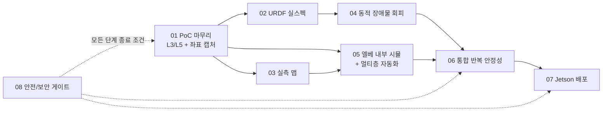

# Roadmap — 시뮬레이션 완성에서 Jetson 실기 투입까지

작성일: 2026-06-12 · 최종 갱신: 2026-08-17 · 담당: Lee (SLAM) · 갱신 주기: 주 단위

> 이 폴더는 "이대로만 따라가면 시뮬레이션 검증을 끝내고 Jetson에 올려 바로 실행"이
> 되도록 단계를 쪼갠 실행 로드맵이다. 각 단계 문서는 목표 → 작업 단계(체크박스) →
> 완료 기준 → 리스크/안전/보안 순서로 같은 틀을 쓴다.

## 전체 지도

## 단계 목록과 권장 순서

| 단계 | 문서 | 핵심 질문 | 선행 | 권장 시점 |
|------|------|----------|------|----------|
| 01 | [01_poc_closure.md](./01_poc_closure.md) | 자동 맵 전환이 실제 Nav2에서도 도는가 | 없음 | 1주차 |
| 02 | [02_urdf_real_spec.md](./02_urdf_real_spec.md) | 시뮬 로봇이 실제 로봇과 같은가 | 01, HW 스펙 확정(Han) | 2~3주차 |
| 03 | [03_real_map_capture.md](./03_real_map_capture.md) | 시뮬 건물이 실제 건물과 같은가 | 01 | 2~3주차 (02와 병렬) |
| 04 | [04_dynamic_obstacles.md](./04_dynamic_obstacles.md) | 사람/장애물 사이에서 안전한가 | 02 | 4주차 |
| 05 | [05_elevator_interior_sim.md](./05_elevator_interior_sim.md) | 엘베 탑승~하차가 연속으로 도는가 | 01, 03 | 5주차 |
| 06 | [06_integration_stability.md](./06_integration_stability.md) | 10번 돌려도 도는가, 고장 나면 멈추는가 | 04, 05 | 6주차 |
| 07 | [07_jetson_deployment.md](./07_jetson_deployment.md) | Jetson에서 그대로 도는가 | 06 (이미지 빌드는 선행 가능) | 7~8주차 |
| 08 | [08_safety_security.md](./08_safety_security.md) | 안전/보안 게이트 (횡단) | - | 매 단계 종료 시 |

주의 2가지:

- **07의 aarch64 이미지 빌드는 지금 바로 시작 가능하고, 가장 먼저 막힐 수 있는 항목**이다. 현재 팀 Docker 이미지가 amd64라면 Jetson(ARM)에서 아예 실행이 안 된다. 빌드/검증에 시간이 걸리므로 06을 기다리지 말고 1주차부터 병렬로 돌릴 것.
- 권장 시점은 작업량 기준 상대 주차다. 실제 마감일은 팀 회의에서 졸업작품 일정에 맞춰 확정하고 이 표를 갱신한다.

## 현재 상태 (2026-07-03 갱신)

world-swap PoC(`test_workspace/gazebo_world_swap/`)가 01·04·05·06의 상당 부분을 앞당겨 달성했다.
각 단계 문서의 `> 상태:` 줄이 세부 기준 — 여기는 요약만.

| 단계 | 상태 | 남은 핵심 |
|------|------|----------|
| 01 PoC 마무리 | `[80%]` | 방 waypoint 좌표 재검토 (improvement_report §1.1) |
| 02 URDF 실스펙 | `[50%]` | hardware_spec.md 확정(모터/배터리), 적재 질량/COM (§1.7) |
| 03 실측 맵 | `⏸` 실측 대기 | 신공학관 복도 실측 → 맵 재생성 (§1.8) |
| 04 동적 장애물 | `[70%]` | collision_monitor 도입, S1~S5 매트릭스 정식 측정 |
| 05 엘베 내부 + 멀티층 | `[40%]` | 멀티층 전환은 **building model swap 방식으로 구현** (teleport A안 대체 — 방식 변경 기록). 엘베 칸 내부 모델링/도킹 정밀도 미완 |
| 06 통합 반복 안정성 | `[60%]` | 반복 10회 통과율 측정, 고장 주입 5종 완결 (현재 recovery/loc-fault 2종 + 부하 P0~P3) |
| 07 Jetson 배포 | `[65%]` | 2026-08-17: Jetson 실기 세팅 완료 + §4.3 idle PASS(8.2%/600%) + **분산 E2E 완주**(데스크톱 Gazebo + Jetson 실전 스택 + 실물 로봇팔 2회, cpu_peak 77.6%/600%) — 절차 §4.5. 남은 것: 실기 센서(RPLiDAR) 주행, 반복 안정성, missed-rate 실기 임계 수립 |
| 08 안전/보안 | 상시 | 소프트/물리 E-stop 미구현 |

다음 관문(우선순위): **03 실측 → 06 완결(반복 10회) → 07 Jetson 실기**.

## 운영 규칙

- 상태 마커는 improvement_report와 동일: (없음)=미착수, `[40%]`=진행, `✅`=완료, `⏸`=보류.
- 각 단계를 시작할 때 해당 문서 상단의 `> 상태:` 줄을 갱신하고, GitHub Issue로 쪼개 라벨(`area:slam` 등)을 단다.
- 단계 완료 선언 전에 [08_safety_security.md](./08_safety_security.md)의 해당 단계 게이트 체크리스트를 통과해야 한다.
- Han(구동부/모델링), Kim(로봇팔) 의존 항목은 각 문서에 "협의 필요"로 표시했다 — 회의 안건으로 올릴 것.

## 이 로드맵이 사용자 요청에 더한 것

요청받은 4개(URDF 실스펙, 실측 맵, 사람/장애물 회피, 엘베 내부 시뮬) 외에 추가한 것과 이유:

| 추가 항목 | 이유 |
|----------|------|
| 01 PoC 마무리 + 좌표 실측 캡처 | 좌표가 seed 값인 상태로는 이후 모든 검증이 모래 위. 자동 맵 전환 L3/L5도 미완 |
| 05에 멀티층 world 자동 전환 포함 | 현 PoC는 Nav2 맵만 바꾸고 Gazebo 건물은 그대로 — 진짜 E2E 시뮬의 마지막 구멍 |
| 06 통합 반복 안정성 | 1회 성공과 시연 가능은 다름. 반복 통과율과 고장 대응이 실기 투입 조건 |
| 07 Jetson 배포 (aarch64) | amd64 이미지는 Jetson에서 실행 불가 — 마지막에 발견하면 일정 전체가 밀림 |
| 08 안전/보안 게이트 | 요청사항 "안정성, 보안 등의 문제도 같이 파악하면서" — 매 단계 종료 조건으로 강제 |
