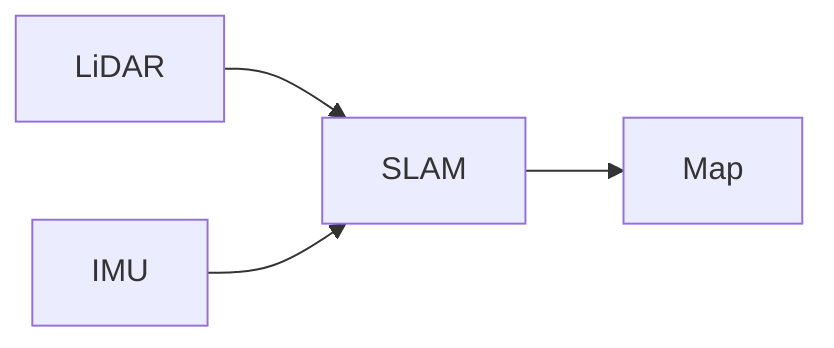

# `docs/` 마크다운 스타일 가이드 (Notion + Obsidian 호환)

> 이 문서는 **`docs/` 하위 모든 `.md` 파일이 따라야 하는 작성 규칙**이다.
> 목적: Notion 위키에 자동 동기화되면서도, 추후 개인 Obsidian vault로 그대로 이전 가능하게 유지.
>
> 적용 도구: Claude Code, Codex CLI, 그 외 모든 AI 어시스턴트.
> 적용 범위: `docs/` 하위 모든 `.md` (단 `docs/_style/` 자체는 동기화 제외).

---

## 1. TL;DR — 5줄 핵심 규칙

1. **헤딩은 H1~H3만**. Notion은 H1~H3 단 3단계. H4+는 굵은 문단으로 폴백됨.
2. **이미지는 상대경로**(`./images/foo.png`). sync 스크립트가 Notion 업로드 시 자동으로 GitHub raw URL로 치환.
3. **금지 문법**: Obsidian wikilinks `[[Page Name]]`, raw HTML 태그(`<details>` 등), footnote `[^1]`.
4. **코드블록은 항상 언어 명시**: ` ```bash `, ` ```python `, ` ```mermaid `. Notion이 인식하는 언어만.
5. **Notion 전용 기교 쓰지 말 것**: toggle, callout 아이콘, synced block 등. 마크다운 + Notion 공통분모만.

---

## 2. 호환 매트릭스

| 요소 | Notion | Obsidian | 사용 가능? |
|---|---|---|---|
| `#`, `##`, `###` 헤딩 | ✅ H1/H2/H3 | ✅ | ✅ |
| `####`+ 헤딩 | ⚠️ 굵은 문단으로 변환 | ✅ | ❌ 피하기 |
| 굵게 `**`, 기울임 `*`, 취소선 `~~` | ✅ | ✅ | ✅ |
| 인라인 코드 `` ` `` | ✅ | ✅ | ✅ |
| 코드블록 (언어 지정) | ✅ | ✅ | ✅ |
| 코드블록 (언어 없음) | ⚠️ plain text로 들어감 | ✅ | ⚠️ 항상 언어 명시 |
| 순서 없는 리스트 `-` | ✅ | ✅ | ✅ |
| 순서 있는 리스트 `1.` | ✅ | ✅ | ✅ |
| 체크박스 `- [ ]` / `- [x]` | ✅ to-do 블록 | ✅ | ✅ |
| 인용 `>` | ✅ | ✅ | ✅ |
| 표 (병합셀 없음) | ✅ | ✅ | ✅ |
| 표 (병합셀, 중첩) | ❌ | ⚠️ | ❌ 단순화하기 |
| 수평선 `---` | ✅ divider | ✅ | ✅ |
| 링크 `[text](url)` | ✅ | ✅ | ✅ |
| 파일 간 링크 `[A](../b/c.md)` | ⚠️ 텍스트 링크로만 (Notion 페이지 연결 X) | ✅ | ✅ (제한적) |
| 이미지 (상대경로) | ❌ 깨짐 | ✅ | sync 스크립트가 처리 → ✅ |
| 이미지 (GitHub raw URL) | ✅ | ✅ | ✅ |
| LaTeX `$$...$$`, `$x^2$` | ✅ | ✅ | ✅ |
| Mermaid (` ```mermaid `) | ✅ 네이티브 렌더링 | ✅ 네이티브 | ✅ |
| YAML frontmatter `---` | ⚠️ Notion 속성에 부분 매핑 | ✅ | ⚠️ 선택적 |
| Obsidian wikilink `[[페이지]]` | ❌ raw text | ✅ | ❌ **금지** |
| Obsidian 콜아웃 `> [!note]` | ⚠️ 일반 인용으로 보임 | ✅ 박스 | ⚠️ 정보 손실 감수 시 |
| Footnote `[^1]` | ❌ raw text | ✅ | ❌ 피하기 |
| HTML 태그 (`<details>`, `<br>`) | ❌ 무시 | ⚠️ 일부 | ❌ **금지** |

---

## 3. 이미지 작성 규칙

### 위치

```
docs/
├── simulation_test/
│   ├── 02_gazebo_slam_mapping/
│   │   ├── images/                    ← 이 폴더에 이미지 저장
│   │   │   ├── kku_map_screenshot.png
│   │   │   └── rviz_initial.png
│   │   └── 03_kku_simulation_quickstart.md
```

### 마크다운에서 참조

```markdown

```

- 항상 `./` 로 시작하는 상대경로.
- 파일명은 영문 소문자 + 언더스코어 (한글/공백 금지 — Obsidian은 OK지만 URL 인코딩 이슈).
- sync 스크립트가 Notion 업로드 시 `https://raw.githubusercontent.com/PackagU/ros2-humble-slam-docker/main/docs/simulation_test/02_gazebo_slam_mapping/images/kku_map_screenshot.png` 로 자동 치환.

### 절대 금지

```markdown
<!-- ❌ 절대경로 -->


<!-- ❌ Obsidian 임베드 -->
![[foo.png]]

<!-- ❌ HTML 태그 -->

```

---

## 4. 코드블록 언어 지정

**항상 언어를 명시**한다. Notion이 인식하는 주요 언어 목록:

```
bash, shell, sh, python, javascript, typescript, c, cpp, rust, go,
java, kotlin, swift, ruby, php, sql, html, css, json, yaml, toml,
markdown, mermaid, plain text, docker, makefile, dart, lua, scala
```

ROS/Linux 워크플로우에서 자주 쓰는 것:

| 내용 | 언어 태그 |
|---|---|
| 터미널 명령 | `bash` |
| ROS launch 파일 | `python` |
| URDF/SDF | `xml` |
| ROS params | `yaml` |
| 다이어그램 | `mermaid` |
| 그냥 텍스트 (로그, 출력) | `plain text` 또는 `text` |

예시:

````markdown
```bash
ros2 launch slam_pkg slam.launch.py
```


````

---

## 5. 헤딩 사용 규칙

- 문서 최상단에 `# 제목` 단 하나 (Notion 페이지 제목으로 추출됨).
- 큰 섹션은 `## `, 세부는 `### `. 그 이상 깊이가 필요하면 **문서를 쪼개라**.
- `####` 이하는 사용하지 말 것. Notion은 H3까지만 지원하며 H4 이상은 굵은 문단으로 변환됨.

```markdown
# 문서 제목 (페이지 제목, H1 단 하나)

## 큰 섹션 (H2)

### 세부 항목 (H3)

#### ❌ 이건 쓰지 말 것
```

---

## 6. 표 작성 규칙

- **표준 마크다운 표만 사용**. 병합 셀, 중첩, HTML 표 금지.
- 머리행과 정렬 표시(`:---:`)는 OK.
- 표 안 텍스트가 너무 길면 표 대신 리스트로 풀어쓰기 권장.

```markdown
| 항목 | 값 | 비고 |
|------|----|----|
| A    | 1  | OK |
| B    | 2  | OK |
```

---

## 7. 링크 규칙

### 외부 링크

```markdown
[ROS2 공식 문서](https://docs.ros.org/en/humble/)
```

### 문서 간 링크 (`docs/` 내부)

- 일반 마크다운 링크 + 상대경로 사용. Notion에서는 텍스트 링크로만 보이고 페이지 연결은 안 되지만, GitHub와 Obsidian에서는 정상 작동.

```markdown
[환경 설정 가이드](../01_environment/01_linux_docker_slam_setup.md)
```

### ❌ 절대 금지

```markdown
<!-- ❌ Obsidian wikilink -->
[[환경 설정 가이드]]
```

---

## 8. Frontmatter (선택적)

YAML frontmatter는 Obsidian에서 메타데이터로 활용된다. Notion에는 일부만 페이지 속성으로 매핑됨.

권장 필드 (있으면 좋고, 없어도 무방):

```yaml
---
title: KKU 가상 맵 사전 시뮬레이션 계획
status: in-progress         # in-progress | done | archived
owner: Lee                  # 작성/유지보수 담당자
updated: 2026-05-27         # 마지막 수정일 (ISO)
tags: [slam, simulation, kku]
---
```

규칙:
- `title`이 있으면 Notion 페이지 제목으로 사용. 없으면 첫 H1 또는 파일명에서 추출.
- 최상단에 `---` 펜스 안에만. 본문에 YAML 섞지 말 것.
- 필수 아님. 없어도 sync 정상 동작.

---

## 9. 파일/폴더 명명 규칙

- 폴더: `01_environment`, `02_gazebo_slam_mapping` — `숫자_영문_소문자`. 번호는 정렬용.
- 파일: `01_linux_docker_slam_setup.md` — 폴더와 동일 규칙.
- 폴더마다 `README.md` 권장 — 해당 폴더의 인덱스 페이지가 됨 (sync 시 부모 페이지 본문으로 들어감).
- 한글 파일명/폴더명 금지 — URL 인코딩 이슈.

---

## 10. 동기화 안 됨 (제외 경로)

다음 경로는 sync 스크립트가 무시한다:

- `docs/_style/` (이 폴더 자체)
- `docs/.notion_sync.json` (매니페스트)
- `docs/**/.DS_Store`, `*.tmp`, `*.swp` 등 OS/편집기 부산물
- 점(`.`)이나 언더스코어(`_`)로 시작하는 모든 파일/폴더

---

## 11. 좋은 예 / 나쁜 예

### ✅ 좋은 예

````markdown
# KKU 가상 맵 동작 확인

> 이 문서는 신공학관 가상 맵으로 SLAM이 도는지 점검하는 절차이다.

## 1. 환경 점검

다음 명령으로 컨테이너가 떠있는지 확인한다.

```bash
docker ps | grep ros2_humble
```

## 2. SLAM 실행

```bash
ros2 launch slam_pkg slam_toolbox.launch.py
```

실행 후 RViz2에서 아래와 같이 보이면 정상.


## 3. 노드 구조

```mermaid
graph LR
    LiDAR[RPLiDAR A1m8] --> SLAM[slam_toolbox]
    IMU[IMU 9축] --> SLAM
    SLAM --> Map[/map]
```
````

### ❌ 나쁜 예

````markdown
#### 너무 깊은 헤딩

<details><summary>토글</summary>HTML 태그 사용</details>

위키링크: [[다른_문서]]

이미지: ![[local.png]]

코드:
```
언어 명시 없음
```

각주[^1]도 쓰지 말 것.

[^1]: Notion이 무시함.
````

---

## 12. AI 어시스턴트(Claude/Codex 등) 위한 작성 지침 요약

`docs/`에 새 `.md`를 만들거나 수정할 때:

- [ ] 헤딩 H1~H3만 사용했는가
- [ ] 코드블록에 언어 태그가 있는가
- [ ] 이미지는 `./images/`에 두고 상대경로로 참조했는가
- [ ] wikilink `[[]]`, HTML 태그, footnote를 쓰지 않았는가
- [ ] 한글 파일명/공백 없는가
- [ ] 표는 표준 마크다운 형식이며 병합셀이 없는가

위 체크리스트가 통과되면 `python scripts/sync_docs_to_notion.py` 한 번에 Notion 위키에 깔끔하게 올라간다.
