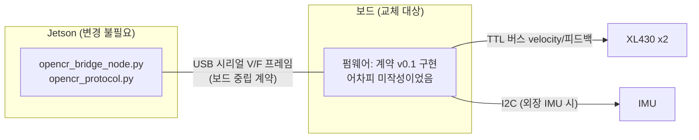

# OpenCR 대체 보드 의사결정 (쇼트 대응)

> OpenCR 1.0 쇼트 사망(improvement_report §1.20, 2026-08-17)에 대한 대응 결정 자료.
> 수리 견적 **18만원** 접수(2026-08-26) → 수리 / 신품 재구매 / 대체 보드 3갈래를 비교한다.
> 가격·재고·기술 사실은 2026-08-26~27 웹 조사 기준(§10 출처). 회의 결정 후 `hardware_spec.md`에 확정 반영할 것.

## 1. 결론 요약

| 순위 | 선택지 | 부품비 (VAT 포함) | 조달 | 추가 작업량 | 한 줄 평가 |
|------|--------|-------------------|------|------------|-----------|
| **1** | **OpenRB-150 + 외장 IMU** | **32,450원~** (보드 27,500 + GY-521 4,950) | 1일 | 펌웨어 1~2주 (원래 하려던 Arduino 작업과 동급) | 수리비의 1/5 가격으로 기존 계획 그대로 진행 |
| **2** | **U2D2 + Power Hub Set** | 63,030원~ (58,080 + IMU) | **10일 (배송지연)** | MCU 펌웨어 소멸, 대신 Jetson측 브리지 개조 3~5일 | 펌웨어 리스크 자체를 제거하는 표준 스택 경로 |
| 3 | OpenCR 1.0 신품 | 242,000원 | 1일 | 0 (기존 계획 그대로) | 유일한 IMU 내장·최저 리스크, 그러나 최고가 |
| 비추천 | 수리 (견적 18만원) | 180,000원 | 미정 | 0 | 신품과 6.2만원 차이인데 보증·원인규명 불명 |
| 비추천 | 일반 STM32 자작 (Nucleo 등) | 약 52,000원~ | 3~7일 | **회로 자작 + 3~6주** | 보드값이 OpenRB-150보다 비싸 비용 논거 자체가 불성립 |
| 탈락 | OpenCM9.04 | - | **전 유통망 판매 종료** | - | XL430 공식 미지원(485 EXP 요구) + 단종 |

핵심 논거 세 가지:

1. **"비용 때문에 STM32"는 성립하지 않는다.** OpenCR 자체가 STM32F746 보드다(udev VID `0483` = ST). 일반 STM32(Nucleo-F446RE 32,016원)로 가면 5V half-duplex 버퍼 회로(74LVC2G241)를 자작해야 하고 Dynamixel2Arduino 공식 지원도 없는데, 로보티즈가 그 회로를 이미 붙여 파는 보드(OpenRB-150)가 **27,500원으로 더 싸다**.
2. **교체 표면이 작다.** Jetson 쪽은 자체 ASCII 시리얼 계약([02_opencr_serial_protocol.md](./deployment/02_opencr_serial_protocol.md))만 요구하고 보드 종류를 모른다. TB3 펌웨어 의존도 없다(turtlebot3_node는 OpenCR 제어테이블 에뮬레이션 전제라 애초에 안 쓰는 구조가 맞았음). OpenCR용 펌웨어는 아직 미작성 상태였으므로 **"펌웨어를 새로 짜는 공수"는 신품 OpenCR을 사도 똑같이 발생한다.**
3. **OpenCR의 진짜 유니크함은 IMU 내장뿐이고, `/imu`는 현재 소비처가 없다.** SLAM Toolbox는 scan+odom만 쓴다. 외장 IMU(4,950원~)로 대체 가능하고, 당장은 IMU 없이도 주행·매핑 체인이 성립한다.

## 2. 배경과 결정 조건

- **경위**: 2026-08-17 Jetson 세팅 중 OpenCR 1.0 쇼트 확인(§1.20). 2026-08-26 수리 견적 18만원 접수.
- **일정 압박**: 로드맵 07(실기 센서 주행)·03(실측 맵) 진입 직전. 실측 매핑은 LiDAR 단독으로도 가능하지만 오도메트리 없는 매핑은 품질 저하 우려(§1.20b). 즉 보드 복구가 실기 관문의 선행 조건.
- **비용 조건**: 팀 예산 민감 — "불편해도 싼 쪽" 선호가 명시된 상태.
- **모터 전제**: 바퀴 모터는 DYNAMIXEL **XL430-W250-T** 기준(공식몰 31,900원 — 2025-06 40% 인하). 이전 후보였던 XH540-W270-T도 같은 TTL Protocol 2.0이라 통신은 동일하나 **전류 사양이 달라 §8.4의 주의가 적용**된다. 모터 자체가 `hardware_spec.md` §2 미정 항목이므로 보드 결정과 모터 확정은 같은 회의에서 묶어 처리할 것.

## 3. OpenCR이 하던 일 — 대체 보드 요구사항

### 3.1 요구사항 정의

| # | 기능 | 요구 수준 | 근거 |
|---|------|----------|------|
| R1 | DYNAMIXEL TTL 버스 (5V half-duplex, Protocol 2.0)로 XL430 2개 velocity 제어 | 필수 | 차동구동 바퀴 |
| R2 | 엔코더 피드백 (Present Velocity/Position 읽기) | 필수 | 오도메트리 |
| R3 | USB 시리얼(115200)로 계약 v0.1 구현 — `V` 20Hz 수신 / `F` 50Hz 송신 | 필수 | [02_opencr_serial_protocol.md](./deployment/02_opencr_serial_protocol.md) |
| R4 | watchdog: `V` 500ms 미수신 시 모터 정지 | 필수 | 계약 §4 (안전) |
| R5 | 9축 IMU (자이로+가속도+쿼터니언) | **현재는 선택** | `/imu` 소비처 없음 — slam_toolbox는 scan+odom만 사용. 추후 odom 보정(robot_localization)용 |
| R6 | 모터 전원 분배 (11.1V 3S → DXL VDD) | 필수 | 어느 보드든 USB 전원으로 모터 구동 불가 |

### 3.2 교체 표면이 작은 이유

- **Jetson 측 코드 무수정**: `src/drive_pkg`의 브리지·오도메트리·teleop은 시리얼 포트만 요구. 포트 경로도 이미 env화(`OPENCR_DEVICE`, docker-compose.jetson.yml)돼 있어 **udev 규칙의 VID/PID 한 줄 + `.env` 한 줄**이 통합 작업의 전부다(절차: [03_hw_update_checklist.md](./deployment/03_hw_update_checklist.md)).
- **TB3 펌웨어 미련 정리**: turtlebot3_node는 OpenCR을 "ID 200, 1Mbps Protocol 2.0 DYNAMIXEL 장치"로 취급해 제어테이블(IMU 영역 포함)을 SDK로 읽는 구조다. OpenCR 아닌 보드에서 재사용하려면 제어테이블 통째 에뮬레이션이 필요해 비현실적 — 자체 계약 유지가 정답이며, 이는 어떤 보드를 골라도 동일하다.

## 4. 옵션 A — OpenCR 1.0 신품 재구매 / 수리

**신품**: 로보티즈 공식몰 **242,000원**, 준비기간 1일 (디바이스마트 등 타 유통 리스팅 없음).

| 장점 | 단점 |
|------|------|
| 기존 문서([opencr_dynamixel_wheel_test.md](./opencr_dynamixel_wheel_test.md))·케이블·udev 그대로 | 최고가 — OpenRB-150 조합의 2.4~7배 |
| **유일한 IMU 내장** (ICM 계열 9축, 쿼터니언 펌웨어 지원) | 쇼트 원인 미규명 시 같은 사고로 또 죽을 수 있음 (§8.2) |
| TB3 레퍼런스·예제 최다, DXL 전원 회로 검증 완료 | 펌웨어 작성 공수는 어차피 동일하게 발생 |
| 12V 전원계 + 5V/12V 출력 등 전원 허브 역할 겸용 | |

**수리(18만원)는 비추천**: 신품과 차액 6.2만원인데 수리품은 보증·잔여 수명·쇼트 원인 부위 외 손상 여부가 불명. 신품 대비 가성비가 나쁘고, 대체 보드 대비로는 3~6배 비싸다. 수리를 고르는 시나리오는 사실상 없다.

## 5. 옵션 B — OpenRB-150 + 외장 IMU (권장 1순위)

로보티즈의 현행 저가 DYNAMIXEL 컨트롤러. 공식몰 **27,500원**, 준비기간 1일.

### 5.1 확인된 스펙 (e-Manual 기준)

| 항목 | 값 | 프로젝트 관점 |
|------|-----|--------------|
| MCU | SAMD21 (Cortex-M0+ 48MHz, Flash 256KB / SRAM 32KB) | 20Hz 명령+50Hz ASCII 피드백에는 충분. micro-ROS는 무리(필요 없음) |
| DXL 포트 | **TTL 3핀 x 4** (각 최대 1Mbps), RS-485 없음 | XL430 2개 + 여유 2포트. 커넥터 JST EH 계열 — **기존 OpenCR용 케이블 재사용 가능** |
| 전원 | VIN/터미널 3.7~12.6V, DXL 전류 사양 3A | 3S LiPo(11.1~12.6V) 직결로 XL430 2개 구동 범위 내 |
| USB | USB-C, 네이티브 CDC (Jetson에서 ttyACM 인식) | 계약 v0.1 그대로 구현 가능 |
| IMU | **없음** | 외장 필요 — §8.1 |
| 개발 | Arduino IDE 보드 패키지 + **Dynamixel2Arduino 공식 지원** (DIR 핀 자동) | 기존 테스트 문서의 코드 경로와 동일 |

### 5.2 필요한 작업

1. **부품**: OpenRB-150 + IMU 모듈(§8.1에서 선택) + 3S 배터리 배선(XT 커넥터 + 인라인 퓨즈 권장).
2. **펌웨어** (Arduino, 1~2주): Dynamixel2Arduino로 (a) XL430 2개 Velocity Control Mode 설정 (b) `V` 파싱 → Goal Velocity 변환(rpm ÷ 0.229) (c) Present Velocity 읽어 `F` 프레임 조립 (d) IMU I2C 읽기 → gyro/accel/quat 필드 (e) 500ms watchdog. — 기존 [opencr_dynamixel_wheel_test.md](./opencr_dynamixel_wheel_test.md)의 스케치 구조를 거의 그대로 재사용한다(`DXL_SERIAL`/DIR 핀 정의만 OpenRB-150용으로 변경, D2A는 DIR 자동).
3. **Jetson 통합** (반나절): `scripts/udev/99-packagu-devices.rules`에 OpenRB-150 VID/PID 추가(`lsusb` 실측) → `/dev/opencr` 심링크 유지 → `.env`의 `OPENCR_DEVICE` 그대로. 브리지 무수정 dry-run 검증.
4. **프로토콜 문서**: 02_opencr_serial_protocol.md의 `HELLO opencr` → `HELLO openrb` 정도만 v0.2로 갱신(브리지는 어차피 무시하는 라인).

### 5.3 리스크

- **12V 전원 부팅 이슈(베타 유닛)**: 12V SMPS + XL430 조합에서 부팅 실패가 로보티즈 스태프에 의해 재현된 포럼 이력 있음. "베타 유닛 한정, 양산품은 레이아웃 다름"이라는 답변이나 완전 해소 명시는 없음 → **수령 즉시 12V 인가 부팅 테스트를 1번 항목으로** 할 것 (불량 시 초기 교환).
- **XH540-W270로 모터 변경 시 직접 급전 불가**: XH540 스톨 4.9A@12V > 보드 DXL 사양 3A. XL430 확정이면 무관 — §8.4.
- IMU 외장화로 배선 1개 추가(I2C 4선). 실패 모드도 그만큼 추가.
- SAMD21 생태계는 OpenCR(STM32F746)보다 성능 여유가 작다 — 단 본 계약의 부하(ASCII 70Hz + DXL 1Mbps)는 문제 없는 수준.

### 5.4 비용·기간

| 구성 | 합계 |
|------|------|
| OpenRB-150 + GY-521(6축) | **32,450원** |
| OpenRB-150 + ICM-20948(9축) | 61,500원 |
| OpenRB-150 + BNO055(fusion 내장) | 101,200원 |

기간: 조달 1일 + 펌웨어 1~2주 + 통합 반나절. **OpenCR 신품 대비 추가 공수는 IMU 코드 2~3일뿐**(나머지 펌웨어는 어느 쪽이든 신규 작성).

## 6. 옵션 C — U2D2 + Power Hub Board (MCU 제거 경로, 2순위)

MCU를 아예 없애고 Jetson이 USB→DXL 변환기로 XL430을 직접 제어하는 구성. U2D2 **36,300원(배송지연 10일)** + PHB Set **21,780원**(U2D2 미포함, 전원 주입 보드+케이블) = **58,080원**.

### 6.1 구조와 확인된 사실

- U2D2: TTL+RS-485 동시 탑재, 최대 6Mbps, FTDI 칩. PHB가 배터리(터미널/DC잭, 3.5~24V 10A)를 DXL VDD로 주입 — XL430 2개 전원 여유 충분.
- **ROS2 Humble 통합 경로가 공식으로 존재**: ROBOTIS 공식 `dynamixel_hardware_interface`(ros2_control)가 Humble 지원 + **`xl430_w250.model` 파일 내장(velocity 단위 변환 포함)**. XL430+U2D2 차동구동 실사례(RoboFoundry 시리즈) 확인됨. 구 dynamixel-community/dynamixel_hardware는 2026-07 아카이브(deprecated) — 신규 구축은 공식 패키지 기준.
- FTDI latency_timer 기본 16ms → udev 규칙으로 1ms 설정 시 2모터 sync read/write 100Hz+ 실용(50Hz 피드백 여유).

### 6.2 두 가지 통합 방식 (선택)

| 방식 | 내용 | 공수 | 특징 |
|------|------|------|------|
| C-1 브리지 개조 | `opencr_bridge_node.py`의 시리얼 계층을 DYNAMIXEL SDK(python, Humble 릴리스됨) 호출로 교체. odom 계산·watchdog·토픽 구조 재사용 | **3~5일** | 기존 구조 최대 보존. 계약 v0.1은 폐기(문서에 사유 기록) |
| C-2 ros2_control 전환 | 공식 dynamixel_hardware_interface + diff_drive_controller. 브리지/자체 odom 폐기 | 1~2주 | 업계 표준 스택 — 이후 확장(조향·팔 통합)에 유리하나 학습 곡선 |

### 6.3 리스크

- **watchdog 위치 이동**: 펌웨어가 없으므로 "명령 두절 시 정지"를 Jetson 유저스페이스가 담당 — 컨테이너/노드 사망 시 정지 보장이 약해진다. 보완: XL430 제어테이블의 Bus Watchdog(98번지, 20ms 단위 — 통신 두절 시 모터 자체 정지) 활성화. 실기 투입 전 펌웨어 버전에서 동작 실측 확인 필요.
- U2D2 **배송지연 10일**이 크리티컬 패스.
- IMU는 Jetson 직결(§8.1) — ROS2 드라이버들이 소규모 커뮤니티 품질(WitMotion ros2 브랜치 WIP, EBIMU는 ROS1만 확인). I2C 직결(40핀) 드라이버(ICM-20948 Humble 명시 repo 존재)도 개인 유지보수 수준이라 도입 전 검증 필요.
- 제어 루프가 Jetson 부하와 경합 — 단 분산 스모크 실측(§4.3, cpu peak 89~94%는 시뮬 포함 수치, idle 8%)상 여유 있고, 로봇 속도 자체가 저속이라 위험도는 낮다.

### 6.4 비용·기간

IMU 포함 63,030원(GY-521, I2C 직결)~92,080원(ICM-20948) / 143,880원(WT901C485 USB형). 기간: **조달 10일이 지배** + 통합 3~5일(C-1 기준).

## 7. 옵션 D — 일반 STM32 자작 (질문 대응: 가능하지만 비권장)

"STM32로 바꾸면?"에 대한 직접 답. **가능은 하다. 그러나 이 프로젝트에서 이득이 없다.**

### 7.1 무엇이 필요한가

1. **회로 자작이 사실상 필수**: XL430 TTL 버스는 **5V 로직 half-duplex 단선**이다. 공식 권장 회로 = 74LVC2G241(또는 NC7WZ241) tri-state 버퍼 + DIR GPIO + 10kΩ 풀업 x2 + 5V 레일 (e-Manual 회로도 판독 확인). 3.3V STM32 직결은 공식 지원이 아니며, XL330/XC330만 3.3V 로직이다. → 만능기판/브레드보드 납땜 작업 + 디버깅용 로직 분석 수단 필요.
2. **라이브러리 비공식**: Dynamixel2Arduino 공식 지원 보드는 OpenCM9.04/OpenCR/OpenRB-150뿐. STM32duino는 목록에 없고(구조상 임의 HardwareSerial+DIR 핀 구성은 가능, 컴파일 차단 이슈는 해소됨), STM32 네이티브 half-duplex 지원 PR #135는 미머지. 즉 동작 보증 없는 조합을 팀이 직접 검증해야 한다. (STM32 HAL로 직접 짜는 사례들은 존재 — Nucleo+XL430 라이브러리, ST3485/MAX485 경유 등.)
3. **ROS 연동**: micro-ROS는 F103급(20KB RAM) 불가, F4급 이상 + CubeMX+FreeRTOS+도커 정적 라이브러리 빌드 체인 — 임베디드 초중급 팀에게 난이도 높음(micro_ros_arduino 지원 보드에도 일반 STM32 없음). 현실적 경로는 **micro-ROS 없이 지금의 자체 시리얼 계약 유지**(ros_arduino_bridge 계열의 검증된 관행) — 그러면 STM32를 골라야 할 이유가 더 없어진다.

### 7.2 소요 추정과 판정

| 단계 | 추정 |
|------|------|
| 부품 조달 (Nucleo-F446RE 32,016원 + 버퍼 IC/부자재 ~1.5만원 + IMU) | 3~7일 |
| 버퍼 회로 제작·단품 검증 | 3~5일 |
| 펌웨어 (비공식 라이브러리 검증 포함) + 통합 | 2~4주 |
| **합계** | **3~6주, 약 52,000원~** |

**판정**: OpenRB-150(27,500원)이 "로보티즈가 74LVC2G241 회로를 미리 붙여 놓은 보드"다. 자작 STM32는 **더 비싸고(부품 합계), 더 오래 걸리고(3~6주 vs 2주), 더 위험하다(비공식 라이브러리+자작 회로)**. OpenCR도 STM32F746이므로 "STM 계열로 가고 싶다"는 요구 자체는 이미 A/B 옵션이 충족한다. 학습 목적이 아니라면 선택할 이유가 없다.

**OpenCM9.04 (STM32F103 로보티즈 보드)도 탈락**: 공식 호환 차트에서 XL430은 485 EXP 확장보드 요구(보드 단독 비호환, 커넥터도 상이) + 로보티즈 KR/EN 몰·국내 유통 전부 판매 종료 + 보드 패키지 2022년 이후 미유지. 후속 포지션이 OpenRB-150이다.

## 8. 공통 과제

### 8.1 외장 IMU 선택지 (옵션 B·C 공통)

`/imu`는 현재 소비처가 없으므로 **1단계(주행 복구)는 IMU 없이 진행 가능**하다. `F` 프레임의 IMU 필드는 0으로 채우고(브리지는 발행만 함), 2단계(odom 보정 도입) 때 아래에서 선택:

| 모듈 | 축 | 가격 | 연결 | 평가 |
|------|-----|------|------|------|
| GY-521 (MPU-6050) | 6축 | **4,950원** | I2C | 최저가. 쿼터니언은 상보/Madgwick 필터로 계산(지자기 없음 → yaw 드리프트). 시작점으로 충분 |
| ICM-20948 | 9축 | 34,000원 | I2C | MPU-9250 단종 후 공식 대체재. OpenCR 내장 IMU와 동급 |
| BNO055 | 9축 | 73,700원 | I2C/UART | **fusion 내장 — 쿼터니언 즉시 출력**, 코드 최소. I2C clock stretching 이슈 유의(클럭 낮추기/UART 모드 우회) |
| WT901C485 | 9축 | 85,800원 | 시리얼 | Jetson 직결형(옵션 C용). ROS2 드라이버 성숙도 주의 |
| EBIMU-9DOFV5 | 9축 | 159,500원 | 시리얼 | 국산·고품질이나 고가, 확인된 ROS2 드라이버 없음(ROS1만) |

옵션 B(보드 I2C 연결)면 GY-521로 시작 → 필요 시 ICM-20948 승급을 권장. 옵션 C(Jetson 직결)면 40핀 I2C + ICM-20948(Humble 드라이버 repo 존재)이 1순위.

### 8.2 쇼트 재발 방지 (어떤 보드를 사도 선행)

§1.20에 쇼트 **원인이 기록돼 있지 않다**. 새 보드 투입 전 반드시:

1. 죽은 OpenCR의 육안 검사로 소손 부위 확인(수리 견적서의 고장 부위 소견 확보 — 견적을 안 쓰더라도 원인 정보는 받아낼 것).
2. 배선 점검: 배터리 극성(XT 커넥터로 통일), DXL 케이블 피복/단선, 프레임 접촉 쇼트 가능성.
3. **배터리 → 보드 사이 인라인 퓨즈**(XL430 2개 기준 5A급) 추가 — 부품비 수천 원.
4. 활선 작업 금지 수칙 재확인(전원 인가 중 커넥터 탈착 금지 — 기존 테스트 문서 §안전 수칙).

### 8.3 코드·설정 변경 목록 (결정 후 실행)

| 대상 | 옵션 B | 옵션 C |
|------|--------|--------|
| `scripts/udev/99-packagu-devices.rules` | OpenRB-150 VID/PID로 `/dev/opencr` 심링크 갱신 | U2D2(FTDI) 규칙 + **latency_timer=1 규칙 추가** |
| `docker/compose` `.env` | `OPENCR_DEVICE` 그대로 | 장치명 변경 + dialout 권한 확인 |
| `src/drive_pkg` | 무수정 | C-1: 시리얼 계층만 SDK로 교체 / C-2: ros2_control 전환 |
| [02_opencr_serial_protocol.md](./deployment/02_opencr_serial_protocol.md) | v0.2 (보드명 갱신, IMU 필드 0 허용 명시) | 폐기 문서로 마킹 + 사유 기록 |
| `hardware_spec.md` §1.1 | MCU 1 행 교체 | MCU 1 행 삭제, 인터페이스 행 추가 |
| `docs/opencr_dynamixel_wheel_test.md` | 보드 준비 절만 OpenRB-150 기준 갱신 | U2D2+Wizard 기준으로 재작성 |

### 8.4 모터 리드타임·전류 주의 (보드보다 급할 수 있음)

- **XL430-W250-T가 공식몰 배송지연 20일**(31,900원). 모터를 아직 확보하지 않았다면 **보드가 아니라 모터가 크리티컬 패스** — 회의에서 모터 발주를 먼저 처리할 것.
- XH540-W270-T로 상향할 경우: 통신·펌웨어는 동일하나 스톨 4.9A@12V라 **OpenRB-150 직접 급전(3A 사양) 불가** → 별도 전원 주입 필요. U2D2+PHB(10A)나 OpenCR은 문제 없음. 20kg 하중 대비 XL430(스톨 1.4N·m)의 토크 여유는 §1.9에서 Han이 검토 중인 별도 사안이며, 모터가 바뀌면 이 문서의 보드 추천 순위도 재검토해야 한다.

## 9. 종합 비교 매트릭스

| 기준 | A 신품 OpenCR | B OpenRB-150+IMU | C U2D2+PHB+IMU | D STM32 자작 |
|------|--------------|------------------|----------------|--------------|
| 부품비 | 242,000 | **32,450~** | 63,030~ | 52,000~ |
| 조달 | 1일 | **1일** | 10일 | 3~7일 |
| 추가 개발 기간 | 기준(펌웨어 1~2주) | 기준+2~3일 | 브리지 개조 3~5일 | **+3~6주** |
| 펌웨어 필요 | 필요 (미작성) | 필요 (동급) | **불필요** | 필요 (최난) |
| XL430 제어 | 공식 | 공식 (D2A) | 공식 (SDK/ros2_control) | 비공식+회로 자작 |
| IMU | **내장** | 외장 (+4,950~) | 외장 Jetson 직결 | 외장 |
| Jetson측 코드 | 무수정 | **무수정** | 개조 필요 | 무수정 |
| watchdog | 펌웨어 | 펌웨어 | Jetson+Bus Watchdog | 펌웨어 |
| 케이블/커넥터 | 그대로 | **그대로 (JST EH)** | PHB 동봉 케이블 | 자작 |
| 고유 리스크 | 가격, 재쇼트 | 12V 부팅 베타 이슈(수령 즉시 테스트) | 배송 10일, IMU 드라이버 품질 | 회로+비공식 라이브러리 |
| 확장성 | TB3 생태계 | DXL 4포트 여유 | RS-485 겸용·팔 통합 유리 | - |

## 10. 시나리오별 추천과 회의 결정 항목

- **비용 최우선 + Arduino 펌웨어를 Han이 맡을 수 있다** → **B (OpenRB-150 + GY-521, 32,450원)**. 기존 계획·문서·케이블·Jetson 코드가 전부 살아 있고, 수리비의 18% 비용.
- **펌웨어 작업 자체를 없애고 싶다 (Han 여력 부족)** → **C (U2D2+PHB)**. 작업이 ROS 측(Lee)으로 이동. 배송 10일을 감안해 즉시 발주 필요.
- **예산이 허용되고 변수 최소화가 최우선** → A 신품. 수리(18만)는 어느 시나리오에서도 비추천.
- **STM32 자작·OpenCM9.04** → 학습 목적이 아니면 배제.

회의에서 결정할 것:

- [ ] 보드 선택 (B 권장 / C / A) — 필요 시 B+C 병행도 가능(합계 9만원대: OpenRB-150은 usb_to_dxl 펌웨어로 U2D2 대용 겸용 가능해 상호 백업이 됨)
- [ ] 죽은 OpenCR 처리 — 수리 포기 여부, 고장 부위 소견 확보
- [ ] 바퀴 모터 최종 확정 (XL430 vs XH540 — §8.4 전류·§1.9 토크 연동) + 발주 시점 (지연 20일)
- [ ] IMU 도입 시점 (1단계 생략 → 2단계 odom 보정 때 도입) 및 모듈 선택
- [ ] 인라인 퓨즈·커넥터 규격 통일 (§8.2)
- [ ] 결정 후 `hardware_spec.md` §1.1 갱신 + §8.3 변경 목록 실행

## 11. 출처 (조사일 2026-08-26~27)

가격 (페이지 직접 확인, VAT 포함):

- OpenCR 1.0 242,000원 / OpenRB-150 27,500원 / U2D2 36,300원(지연 10일) / U2D2 PHB Set 21,780원 / XL430-W250-T 31,900원(지연 20일): [로보티즈 공식몰](https://www.robotis.com/shop/list.php?ca_id=3040)
- GY-521 4,950원 / ICM-20948 39,820원 / NUCLEO-F446RE 39,600원: [디바이스마트](https://www.devicemart.co.kr) · ICM-20948 34,000원: [메카솔루션](https://mechasolution.com) · BNO055 73,700원: [엘레파츠](https://www.eleparts.co.kr) · NUCLEO 32,016원: [아이씨뱅큐](https://www.icbanq.com)
- OpenCM9.04: 로보티즈 KR/EN 상품페이지 제거·국내 유통 품절/보류 확인 (공식 EOL 공지문은 미발견 — "전 유통망 판매 종료" 판정)

기술:

- XL430 사양(5V TTL half-duplex, velocity mode, Bus Watchdog): [XL430-W250 e-Manual](https://emanual.robotis.com/docs/en/dxl/x/xl430-w250/)
- TTL 공식 회로(74LVC2G241 + 10k 풀업): [DYNAMIXEL TTL 회로도](https://emanual.robotis.com/assets/images/dxl/ttl_circuit.png)
- OpenRB-150 사양·전원 3A·JST EH: [OpenRB-150 e-Manual](https://emanual.robotis.com/docs/en/parts/controller/openrb-150/) / 12V 부팅 베타 이슈: ROBOTIS 포럼 t/1344 (Wayback)
- Dynamixel2Arduino 지원 보드(STM32 없음, PR #135 미머지): [GitHub](https://github.com/ROBOTIS-GIT/Dynamixel2Arduino)
- U2D2/PHB: [U2D2 e-Manual](https://emanual.robotis.com/docs/en/parts/interface/u2d2/) · [PHB e-Manual](https://emanual.robotis.com/docs/en/parts/interface/u2d2_power_hub/)
- ROS2 Humble 공식 하드웨어 인터페이스(xl430_w250.model 포함): [dynamixel_hardware_interface](https://github.com/ROBOTIS-GIT/dynamixel_hardware_interface) — 구 [dynamixel-community/dynamixel_hardware](https://github.com/dynamixel-community/dynamixel_hardware)는 2026-07 아카이브
- XL430+U2D2 차동구동 실사례: [RoboFoundry 시리즈](https://robofoundry.medium.com/ros2-control-differential-drive-robot-project-part-1-mechanical-build-2a323da04992)
- turtlebot3_node의 OpenCR 제어테이블 의존: [control_table.hpp](https://github.com/ROBOTIS-GIT/turtlebot3/blob/humble/turtlebot3_node/include/turtlebot3_node/control_table.hpp)
- micro-ROS STM32 요구사양·F103 불가: [micro_ros_stm32cubemx_utils](https://github.com/micro-ROS/micro_ros_stm32cubemx_utils) issue #35
- FTDI latency_timer 1ms: [U2D2 e-Manual USB latency 절](https://emanual.robotis.com/docs/en/parts/interface/u2d2/)
- MCU=단순 시리얼 + PC 노드 관행: [ros_arduino_bridge](https://github.com/hbrobotics/ros_arduino_bridge) · [serial_motor_demo](https://github.com/joshnewans/serial_motor_demo)
